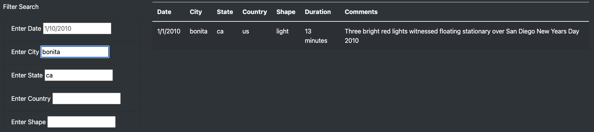

# UFOs

## Overview
A hytpothetical friend named Dana wants to create a page where viewers can sort through UFO data she has provided using JavaScript.  

## Results
To perform a search, simply input you search criteria in the spaces provided and press enter.  The sightings that fit under your criteria will then be filtered as shown below.

  

## Summary
One drawback for this set up is that it requires exact input that might match sighting information.  For instance, if you wanted to filter for all sightings in california and you used "california" or "CA" in the input field, it would show 0 results.  I would recommend further work on the input fields to allow at least for any kind of case and maybe some small instructions on the page itself to warn people of the limitations.  it might also be cool to add some sort of chart or map.  Right now it only works if people know exactly hwat they're looking for.  It might be nice to show an initial chart showing the amount of sightings depending on country so people can have somke kind of guide if they're just looking for fun.
